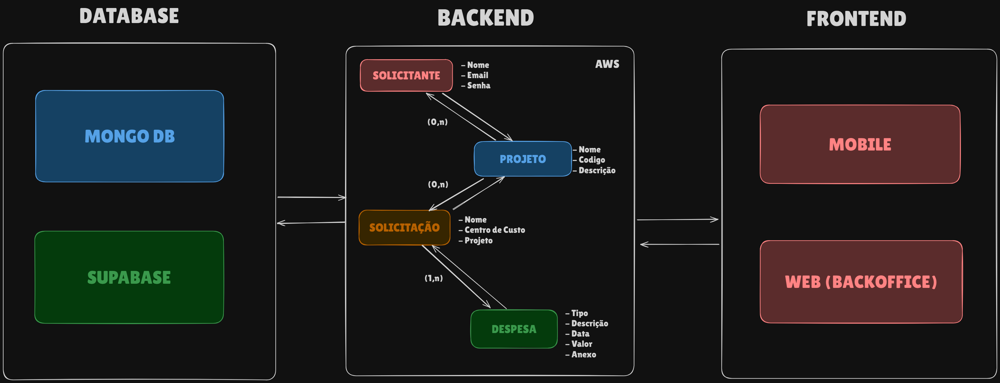

## ❔ Explicação do projeto  

O desafio é desenvolver um aplicativo móvel para o lançamento de reembolso de despesas, garantindo praticidade e precisão no registro das informações. O aplicativo deve permitir que os usuários registrem suas despesas. Além disso, deve ser possível anexar comprovantes, inserir descrições e acompanhar o status de aprovação das solicitações. Se o valor estiver acima do limite, alertar o usuário.
<!--
## 👀 Demonstração do produto
➯ [Vídeo de demonstração](https://youtu.be/D8LDeAe5Wgo)

## 📄 Backlog
➯ Acesse o backlog completo [aqui](https://cold-spice-64e.notion.site/12128f34d09580f5a685f331ad284884?v=12128f34d09581d790f6000c6fa5996d&pvs=4)
-->

## 📋 Requisitos
#### ➯ Funcionais
| Nº do requisito | Requisito do Parceiro                                                                                                                         |
| ------------------- | ----------------------------------------------------------------------------------------------------------------------------------------------- |
| RF1                 | Permitir o registro de despesas informando:  - Tipo de despesa  - Data da despesa  - Valor ou quantidade |
| RF2                 | Permitir o anexo de comprovantes de despesa |
| RF3                 | Permitir a inserção de uma descrição para a despesa |
| RF4                 | Exibir alerta caso o valor da despesa esteja acima do limite permitido |
| RF5                 | Permitir o acompanhamento do status de aprovação das solicitações de reembolso |
| RF6                 | Integrar com o sistema corporativo para fornecer e receber os seguintes dados:  - Informações do solicitante (Nome, Centro de Custo, Projeto)  - Detalhes da despesa (Data, Valor, Quantidade, Descrição, Anexo)|

#### ➯ Não funcionais
| Nº do Requisito | Requisito do Parceiro                                      |
| ------------------- | ---------------------------------------------------------- |
| RNF1                | Manual do Usuário |
| RNF2                | Documentação API – Application Programming Interface|
| RNF3                | Modelagem de Banco de Dados |

## 🧰 Tecnologias utilizadas
- [Next.js](https://nextjs.org)
- [React](https://react.dev)
- [TypeScript](https://www.typescriptlang.org)
- [Node.js](https://nodejs.org)
- [NestJS](https://nestjs.com)
- [Supabase](https://supabase.com)
- [AWS (Amazon Web Services)](https://aws.amazon.com)
- [MongoDB](https://www.mongodb.com)
- [Docker](https://www.docker.com)
- [React Native](https://reactnative.dev)
- [Expo](https://expo.dev)
- [Chakra UI](https://chakra-ui.com)
- [Tailwind CSS](https://tailwindcss.com)
  
## 🛠️ Outras Ferramentas utilizadas
- [Trello](https://www.trello.com)
- [Figma](https://www.figma.com)
- [Canva](https://www.canva.com)

## Workflow

## 👨‍💻 Integrantes da Equipe

  
|Nome|Função|GitHub|Linkedin|
| -------- |-------- |-------- |-------- |
|**Abner Machado**|Product Owner|[@GitHub](https://github.com/abnerdouglas)|[@Linkedin](https://www.linkedin.com/in/abner-douglas-a70a9b199/)
|**Ryan Seiji Wakugawa**|Scrum Master|[@GitHub](https://github.com/ryan-wakugawa)|[@Linkedin](https://www.linkedin.com/in/ryan-wakugawa-526bbb27a)
|**Bruno Silvério**|Desenvolvedor|[@GitHub](https://github.com/BrunoVieira30)|[@Linkedin](https://www.linkedin.com/in/bruno-vieira-b999a2224/)
|**Cauã Dezidera**|Desenvolvedor|[@GitHub](https://github.com/CauaDezidera)|[@Linkedin](https://www.linkedin.com/in/cauã-dezidera-375736275/) 
|**Mateus Madeira**|Desenvolvedor|[@GitHub](https://github.com/mafemad)|[@Linkedin](https://www.linkedin.com/in/mateus-ferreira-madeira)
|**Pedro Kajiya**|Desenvolvedor|[@GitHub](https://github.com/kajiyap)|[@Linkedin](https://www.linkedin.com/in/pedro-santos-kajiya-65763b260/)
|**Erick Hideki**|Desenvolvedor|[@GitHub](https://github.com/erickhoawata)|[@Linkedin](http://linkedin.com/in/érick-awata)

   
  

