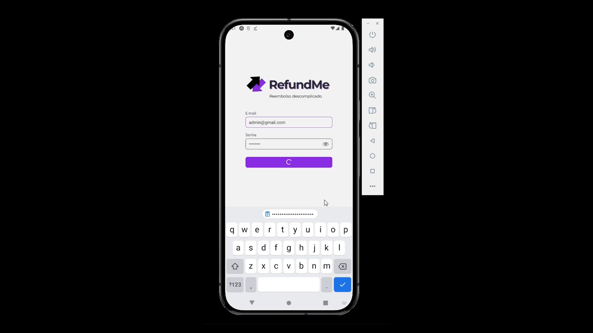
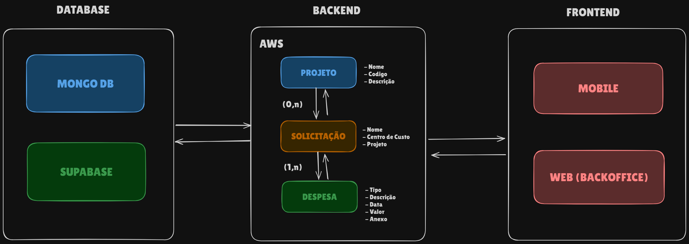

## ❔ Explicação do Projeto

O projeto **RefundMe** foi desenvolvido como parte do desafio prático proposto pela empresa GSW Software para os alunos do 5º semestre do curso de Análise e Desenvolvimento de Sistemas da Fatec São José dos Campos.

A proposta consiste em desenvolver um sistema completo de **reembolso corporativo**, onde funcionários possam registrar suas **solicitações de reembolso de despesas**, anexar comprovantes e acompanhar o status de aprovação. O sistema também conta com um painel administrativo exclusivo para gestores aprovarem ou rejeitarem as solicitações com base em regras pré-definidas, como **limites por projeto**.

Além da aplicação mobile, também foi desenvolvido um **backoffice web** e uma **API robusta** com deploy em nuvem.

---

## 🧩 Estrutura do Projeto

O projeto foi dividido em **três repositórios independentes**, refletindo a arquitetura desacoplada da solução:

| Repositório       | Descrição                                                                 |
|-------------------|---------------------------------------------------------------------------|
| `refundme-backend`    | API REST construída em NestJS, conectada ao MongoDB Atlas, com deploy em AWS. |
| `refundme-web`    | Aplicação web administrativa desenvolvida em Next.js para usuários do tipo admin. |
| `refundme-mobile` | Aplicativo mobile feito em React Native com Expo, voltado a funcionários.  |

---

## 🎯 MVP do Projeto

Clique na imagem abaixo para ser redirecionado ao vídeo demonstrativo com todas as funcionalidades entregues:

## ✅ Funcionalidades Implementadas

### Mobile (Funcionário)
- Autenticação com controle de acesso por perfil
- Cadastro de solicitações de reembolso
- Registro de despesas por valor ou quantidade
- Anexar imagem como comprovante (via câmera ou galeria)
- Validação e alerta de limite excedido
- Visualização de projetos disponíveis
- Acompanhamento do status da solicitação

### Web (Administrador)
- Autenticação exclusiva para administradores
- Listagem e análise das solicitações
- Visualização de despesas vinculadas
- Aprovação ou rejeição de solicitações com controle de status
- Cadastro, edição e exclusão de usuários
- Gerenciamento de projetos e centros de custo

### API (Backend)
- Estrutura em NestJS com tipagem forte em TypeScript
- Autenticação com JWT e controle de acesso
- Upload de arquivos (comprovantes) via AWS S3
- Modelagem relacional entre Projetos, Solicitações e Despesas
- Deploy da aplicação em instância EC2
- Banco de dados hospedado na nuvem com MongoDB Atlas
- Documentação interativa da API com Swagger

## 🧰 Tecnologias Utilizadas

### 📱 Mobile
- React Native + TypeScript
- Expo
- Gluestack UI
- TailwindCSS

### 💻 Web (Admin)
- Next.js + React
- Chakra UI
- TailwindCSS
- Redux Toolkit

### 🌐 API
- NestJS
- Node.js + TypeScript
- MongoDB + Mongoose
- MongoDB Atlas
- AWS S3 (armazenamento de imagens)
- AWS EC2 (hospedagem da API)
- Swagger (documentação da API)

### 🧪 Testes e Outros
- Postman (testes de API)
- GitHub Projects (kanban e organização)
- Trello (sprints e tarefas)
- Figma (design das telas)
- Canva (materiais visuais)

## 🔀 Fluxo da Solução

Um projeto pode conter múltiplas **solicitações de reembolso**, e cada solicitação pode conter múltiplas **despesas**. O fluxo completo envolve:

## Workflow

## 👨‍💻 Integrantes da Equipe

| Nome                | Função           | GitHub                                                                 | LinkedIn                                                                 |
|---------------------|------------------|------------------------------------------------------------------------|--------------------------------------------------------------------------|
| **Abner Machado**   | Product Owner    | [🌐 GitHub](https://github.com/abnerdouglas)                           | [🔗 LinkedIn](https://www.linkedin.com/in/abner-douglas-a70a9b199/)      |
| **Ryan S. Wakugawa**| Scrum Master     | [🌐 GitHub](https://github.com/ryan-wakugawa)                          | [🔗 LinkedIn](https://www.linkedin.com/in/ryan-wakugawa-526bbb27a)       |
| **Bruno Silvério**  | Desenvolvedor    | [🌐 GitHub](https://github.com/BrunoVieira30)                          | [🔗 LinkedIn](https://www.linkedin.com/in/bruno-vieira-b999a2224/)       |
| **Cauã Dezidera**   | Desenvolvedor    | [🌐 GitHub](https://github.com/CauaDezidera)                           | [🔗 LinkedIn](https://www.linkedin.com/in/cauã-dezidera-375736275/)      |
| **Mateus Madeira**  | Desenvolvedor    | [🌐 GitHub](https://github.com/mafemad)                                | [🔗 LinkedIn](https://www.linkedin.com/in/mateus-ferreira-madeira)       |
| **Pedro Kajiya**    | Desenvolvedor    | [🌐 GitHub](https://github.com/kajiyap)                                | [🔗 LinkedIn](https://www.linkedin.com/in/pedro-santos-kajiya-65763b260/)|
| **Erick Hideki**    | Desenvolvedor    | [🌐 GitHub](https://github.com/erickhoawata)                           | [🔗 LinkedIn](http://linkedin.com/in/érick-awata)                        |

   
  

